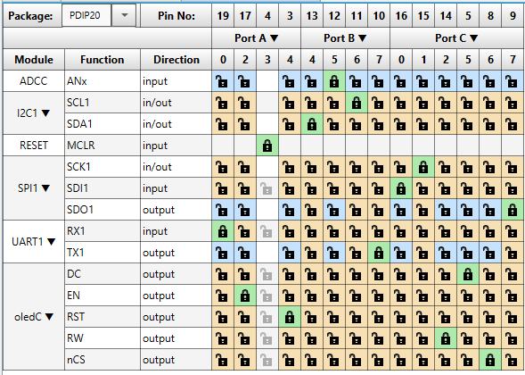
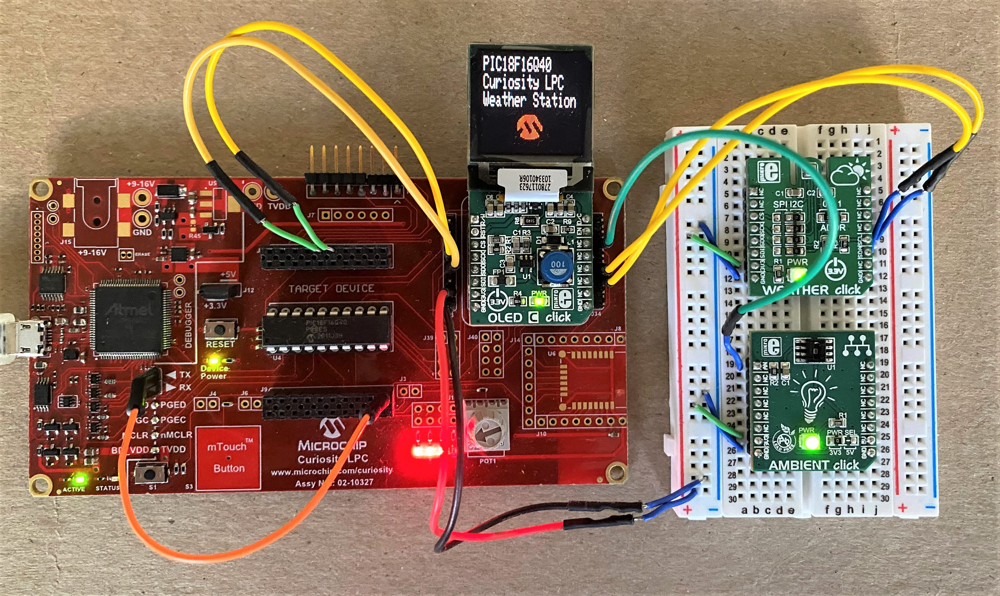
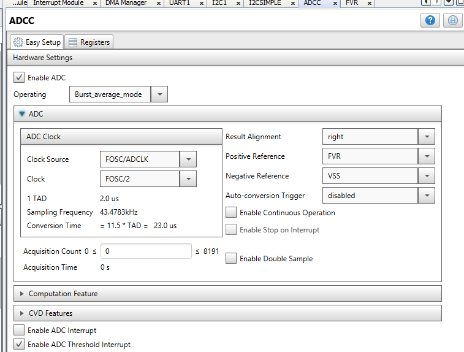
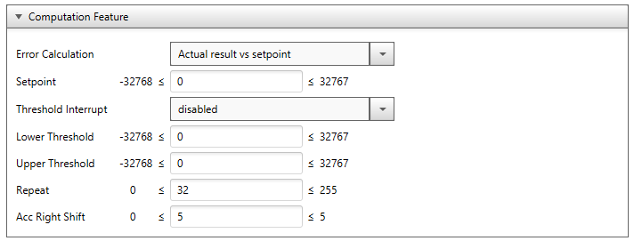
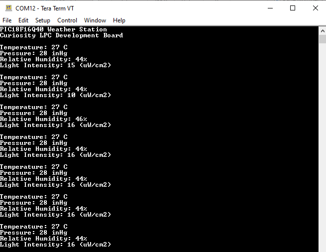

<a href="https://www.microchip.com" rel="nofollow"></a>

# OBJECTIVE:

The “pic18f16q40-weather-station” project highlights the advanced communications peripherals found on the PIC18-Q40 family of devices to create a PIC18 powered weather station. The I2C module was used to interface a Bosch BME280 Weather Sensor to provide real-time measurements for temperature, relative humidity, and atmospheric pressure. This project also implements the 12-bit Analog to Digital Converter with Computation (ADCC) to interface an analog ambient light sensor which was used to measure light intensity. The SPI module was used to drive an OLED display to display the weather station output values in real time, and the UART module was used to also display the weather station output values over a serial port in real time.

# Software Used:
  - MPLAB® X IDE 5.40 or newer [(microchip.com/mplab/mplab-x-ide)](http://www.microchip.com/mplab/mplab-x-ide)
  - MPLAB® XC8 2.20 or a newer compiler [(microchip.com/mplab/compilers)](http://www.microchip.com/mplab/compilers)
  - MPLAB® Code Configurator (MCC) 3.95.0 or newer [(microchip.com/mplab/mplab-code-configurator)](https://www.microchip.com/mplab/mplab-code-configurator)
  - MPLAB® Code Configurator (MCC) Device Libraries PIC10 / PIC12 / PIC16 / PIC18 MCUs [(microchip.com/mplab/mplab-code-configurator)](https://www.microchip.com/mplab/mplab-code-configurator)
  - Microchip PIC18F-Q Series Device Support (1.5.124) or newer [(packs.download.microchip.com/)](https://packs.download.microchip.com/)

# Hardware Used:
  - [PIC18F16Q40 Microcontroller](https://www.microchip.com/wwwproducts/en/PIC18F16Q40)
  - [Curiosity Low Pin Count (LPC) Development Board](https://www.microchip.com/DevelopmentTools/ProductDetails/DM164137)     
  - [MikroElektronika Weather Click Board](https://www.mikroe.com/weather-click)
  - [MikroElektronika Ambient Click Board](https://www.mikroe.com/ambient-click)      
  - [MikroElektronika OLED C Click Board](https://www.mikroe.com/oled-c-click)         

# Demo Configuration:
The Curiosity Low Pin Count (LPC) Development Board (Part # DM164137) was selected as the development platform for this code example. The weather station display was implemented using the MikroElektronika OLEDC Click board (MIKROE-1585), the Bosch BME280 weather sensor was provided using the MikroElektronika Weather Click Board (MIKROE-1978), and the ambient light sensor was provided using the MikroElektronika Ambient Click Board (MIKROE-1890). The Curiosity LPC Development Board only has one MikroBUS socket which was used for the OLED display, so the other two sensor boards (Ambient Click and Weather Click) were connected using a breadboard and jumper wires. The jumper wire connections needed to connect the sensors on the breadboard to the PIC18F16Q40 on the Curiosity LPC Development Board are the following:

- Yellow wires: Connections between SDA / SCL on the Weather Click for I2C communication, to the corresponding SDA and SCL pins on the Curiosity LPC development board.

  - Note: Resistors R55 and R53 must be removed from   the back of the Curiosity LPC development board to disconnect the SPI SCK and MISO signals from the existing pins and re-route them to the pins described below.


- Green wire: Connection between the analog output of the Ambient Click Board to the corresponding positive ADC channel on the PIC microcontroller.

- Red / black wires: Ground and 3.3V from the Curiosity LPC Development Board to the Breadboard where the sensors are placed.

Additionally, a jumper wire (orange wire) was used to connect the UART TX pin (RB7) of the PIC18F16Q40 to the TX connection on the Curiosity LPC Virtual COM port for serial communication. The following table summarizes the signal connections used in this code example:


|Signal                    | Microcontroller Pin     |
|------------------------- | :--------------------: |
|UART TX	                 | RB7                    |
|Weather Click – SDA (I2C) | RB4                    |
|Weather Click – SCL (I2C) | RB6                    |
|OLEDC Click – SDO (SPI)	 | RC7                    |
|OLEDC Click – SDI (SPI)	 | RC0                    |
|OLEDC Click – SCK (SPI)	 | RC1                    |
|OLEDC Click – CS (SPI)	   | RC6                    |
|OLEDC Click – DC	         | RC5                    |
|OLEDC Click – EN	         | RA2                    |
|OLEDC Click – RST	       | RA4                    |
|OLEDC Click – RW	         | RC2                    |
|Ambient Click Output      | RB5                    |

### MCC Pin Manager Window View:
</a>

### Curiosity LPC Project Setup:
</a>

# I2C Module Configuration:
The I2C module was used in this code example to communicate with the Bosch BME280 weather sensor to measure temperature, pressure, and relative humidity. For this example, the I2C module was initialized using the MPLAB Code Configurator (MCC). The I2C was configured to operate with a standard clock speed of 100 kHz, and external pull-up resistors were used on both the SDA and SCL pins. The slave address of the BME280 weather sensor was 0x76. The temperature, pressure, and humidity measurements were acquired from the Bosch BME280 weather sensor as raw uncompensated outputs.

### BME280 Weather Sensor Compensation Routines:
The I2C module was used in this example to read the temperature, pressure, and humidity from the BME280 sensor. The temperature and pressure are read as 20-bit unsigned values, and the relative humidity is read as a 16-bit signed value. These sensor measurements obtained using the I2C module are raw data measurements from the weather sensor, and compensation routines must be used to convert the raw sensor outputs to values that can be used for display. The BME280 weather sensor has a set of compensation parameters stored in the device memory that must be read and stored by the PIC microcontroller. These compensation parameters are all used in the conversion routines to properly convert the raw sensor output to the final output results. The compensation routines used to convert the BME280 raw outputs to temperature in degrees Celsius, atmospheric pressure in inches of mercury, and relative humidity as a percentage are shown below.

### Temperature Compensation Routines (°C):
```c
static uint32_t BME280_compensateTemperature(void) {
    long tempV1, tempV2, t;

    tempV1 = ((((adc_T >> 3) - ((long) calibParam.dig_T1 << 1))) * ((long) calibParam.dig_T2)) >> 11;
    tempV2 = (((((adc_T >> 4) - ((long) calibParam.dig_T1)) * ((adc_T >> 4) - ((long) calibParam.dig_T1))) >> 12)*((long) calibParam.dig_T3)) >> 14;
    t_fine = tempV1 + tempV2;
    t = (t_fine * 5 + 128) >> 8;
    t = t / 100;
    return t;
}
```

### Atmospheric Pressure Compensation Routine (inHg):
```c
static uint32_t BME280_compensatePressure(void) {
    long pressV1, pressV2;
    uint32_t p;
    pressV1 = (((long) t_fine) >> 1) - (long) 64000;
    pressV2 = (((pressV1 >> 2) * (pressV1 >> 2)) >> 11) * ((long) calibParam.dig_P6);
    pressV2 = pressV2 + ((pressV1 * ((long) calibParam.dig_P5)) << 1);
    pressV2 = (pressV2 >> 2)+(((long) calibParam.dig_P4) << 16);
    pressV1 = (((calibParam.dig_P3 * (((pressV1 >> 2) * (pressV1 >> 2)) >> 13)) >> 3) +
            ((((long) calibParam.dig_P2) * pressV1) >> 1)) >> 18;
    pressV1 = ((((32768 + pressV1))*((long) calibParam.dig_P1)) >> 15);
    if (pressV1 == 0) {
        // avoid exception caused by division by zero
        return 0;
    }
    p = (((uint32_t) (((long) 1048576) - adc_P)-(pressV2 >> 12)))*3125;

    if (p < 0x80000000) {
        p = (p << 1) / ((uint32_t) pressV1);
    } else {
        p = (p / (uint32_t) pressV1) * 2;
    }

    pressV1 = (((long) calibParam.dig_P9) * ((long) (((p >> 3) * (p >> 3)) >> 13))) >> 12;
    pressV2 = (((long) (p >> 2)) * ((long) calibParam.dig_P8)) >> 13;
    p = (uint32_t) ((long) p + ((pressV1 + pressV2 + calibParam.dig_P7) >> 4));
    return p;
}

```

### Relative Humidity Compensation Routine (%):
```c
static uint32_t BME280_compensateHumidity(void) {
    long humV;
    uint32_t h;

    humV = (t_fine - ((long) 76800));
    humV = (((((adc_H << 14) - (((long) calibParam.dig_H4) << 20) - (((long) calibParam.dig_H5) * humV)) +
            ((long) 16384)) >> 15) * (((((((humV * ((long) calibParam.dig_H6)) >> 10) *
            (((humV * ((long) calibParam.dig_H3)) >> 11) + ((long) 32768))) >> 10) +
            ((long) 2097152)) * ((long) calibParam.dig_H2) + 8192) >> 14));
    humV = (humV - (((((humV >> 15) * (humV >> 15)) >> 7) * ((long) calibParam.dig_H1)) >> 4));
    humV = (humV < 0 ? 0 : humV);
    humV = (humV > 419430400 ? 419430400 : humV);

    h = (uint32_t) (humV >> 12);
    return h;
}
```


# ADCC Module Configuration
The ADCC was used in this code example to measure the output of the ambient light sensor. This peripheral was configured in Burst-Average mode for this sensor interface, which allows the ADC to core independently perform a pre-determined burst of conversions while accumulating the conversion results. In Burst-Average mode once the specified number of conversions have been completed, the accumulated sum of the conversion results is then right shifted (or divided) by the specified number of bits core independently. The purpose of this hardware feature is to allow the ADC to perform averaging without any software intervention. The right shifted result can be read from the ADFLTR register.

The ADC conversion result was then used to calculate the ambient light intensity in µW/cm2 using the characteristic curve provided in the sensor datasheet. The following code snippet shows the firmware used to perform the burst-average conversion on the ambient light sensor output, and the compensation routine used to convert the raw analog value to light intensity. The MPLAB Code Configurator was used to quickly and easily setup of the ADCC module for this sensor interface. The setup and configuration of the ADCC using MCC is shown in the figure below. The ADCC was configured to perform 32 burst average conversions and then right shift them by 5 (divide by 32).

### ADCC Burst-Average Mode MCC Configuration:
</a>

### ADCC Computation Feature MCC Configuration:
</a>

### Ambient Light Sensor Acquisition & Compensation:
```c
float Ambient_ReadSensor(void) {
    ADPCH = AMBIENT; // Select AMBIENT analog channel as ADCC positive input;
    ADCON0bits.ADGO = 1; // Trigger burst-average ADCC conversions;
    while (ADCON0bits.ADGO); // Wait for ADC Threshold Interrupt Flag to set;
    while (!PIR2bits.ADTIF); // Wait for ADC Threshold Interrupt Flag to set;
    return (ADCC_GetFilterValue()); // Return ADC Burst Average Result;
}

float AmbientCompensation(void) {

  #define ADCC_RESOLUTION         4096
  #define ADCC_POS_REFERENCE      4.096
  #define POLY1_TERM1             147.2
  #define POLY1_TERM0             -9.5  

  float Ambient_Raw, Ambient_Volt, Light_Intensity;
  Ambient_Raw = Ambient_ReadSensor();
  // Calculate ADC voltage using conversion result;
  Ambient_Volt = (Ambient_Raw / ADCC_RESOLUTION) * ADCC_POS_REFERENCE;
  Light_Intensity = (POLY1_TERM1 * Ambient_Volt) + POLY1_TERM0; // Calculate ambient light intensity;
  return (Light_Intensity); // Return light intensity (uW/cm^2);
}
```
# SPI Module Configuration:
The SPI module was used in this code example to communicate with the OLEDC display to show the real-time weather station output results. The OLEDC library in MCC was used to generate the initialization code and functional APIs needed to use the display. The library sets up the SPI module with the correct configuration to ensure proper communication between the PIC microcontroller and the display driver, and also provides a set of functional APIs that make getting started with the display quick and easy. To add the OLEDC library to an MPLABX project, open MCC and navigate to the "Device Resources" section. Once inside the Device Resources section, select the “Mikro-E Clicks” drop down menu, select “Displays”, and then add in the "oledC" library. The functional APIs provided by the oledC library in MCC handle all of the SPI communication between the PIC and the display driver.


# UART Module Configuration:
The UART module was used in this code example as an alternative way of displaying the weather station output results by printing the temperature, pressure, humidity, and ambient light intensity periodically using a serial port. The UART module was configured using MCC in Asynchronous 8-bit mode with a baud rate of 9600 baud. Transmission and reception were both enabled, and the “Redirect STDIO to UART” checkbox was selected under the software settings tab to include the library needed for “printf” functions. The UART TX pin was selected as pin RB7 and connected to the TX pin of the Virtual COM port on the Curiosity LPC Development Board (orange wire).

# Weather Station Serial Port Output Results:
</a>

# Weather Station OLED Display Output Results:
</a>
